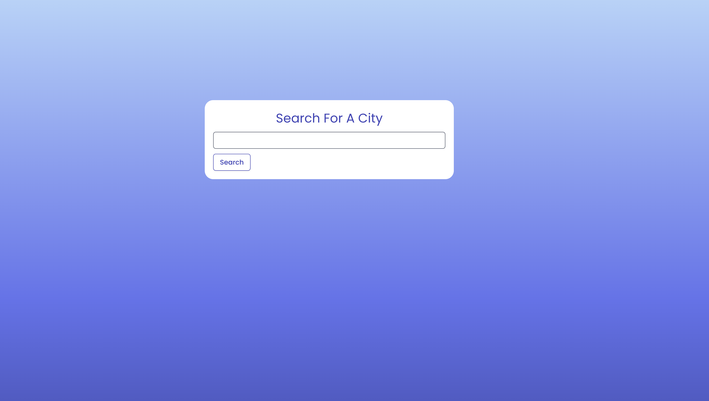

# Weather-App-Refactor
 

## Table of Contents

* [Introduction](#introduction)
* [Features](#features)
* [Installation](#installation)
* [Technologies Used](#technologies-used)
* [Usage](#usage)
* [Screenshots](#screenshots)
* [Future Developments](#future-developments)
* [Contact](#contact)
* [Contributions](#contributions)
* [License](#license)
* [Demo](#demo)

# Introduction

This is a previous server-side API project that has been refactored that integrates React as well the dotenv module to ensure a seamless and secure application is produced.

# Features

- Ability to search for a city and receive current and future weather conditions for that particular area.
- Weather results including an icon to demonstrate the weather conditions, humidity percentage, temperature, and wind speed.
- Ability to see previously searched cities.
- Greater interactivity due to search history css styling animations.
- Ability to click a previously searched city and receive current and future weather conditions for that area.
- Secure storage of API key utilized to access OpenWeatherMap's API.

# Installation

This project can be accessed via the live demo link or locally by following these steps:

1. Clone the repository to your local machine.
2. Install the necessary dependencies by running `npm install`.
3. Start the application by running `npm run start` in your terminal.

# Technologies Used

- React
- CSS Styling
- Local Storage
- CSS Animations
- Bulma Framework
- OpenWeatherMap API
- Google Fonts
- Dotenv

# Usage

Navigate to the application.

- Identify the search bar card in the center of the page.
- Enter a city and click search.
- Identify the search bar on the side along with the clickable search history.
- Identify the top card that includes the current weather conditions for the searched city.
- Identify the five cards below that showcases the five day weather forecast for that city.
- Navigate to the side of the page and enter another city on the search bar and click search.
- Identify the previous city that was searched for under the search bar and click that city.
- Recognize the current and future weather conditions for city that was clicked.

# Screenshots

### Landing Page

### Results

# Future Developments

- Enable users to delete all or each individual city in the search history.
- Enable more weather statistics such as what the temperature feels like and air quality.
- Enable users to be able to visually see weather changes with a map.

# Contact

If there are any questions or feedback, feel free to reach out via: 

* GitHub Issues: [Github](http://Github.com/Taylor-Brandon)

* Email: [Email](mailto://taylorbrandon.dev@gmail.com)

# Contributions

Special thanks to Columbia Bootcamps for providing the educational resources necessary to complete this project.

# License

# Demo

Navigate to Demo: [Here](https://taylor-brandon.github.io/Weather-App-Refactor/)
